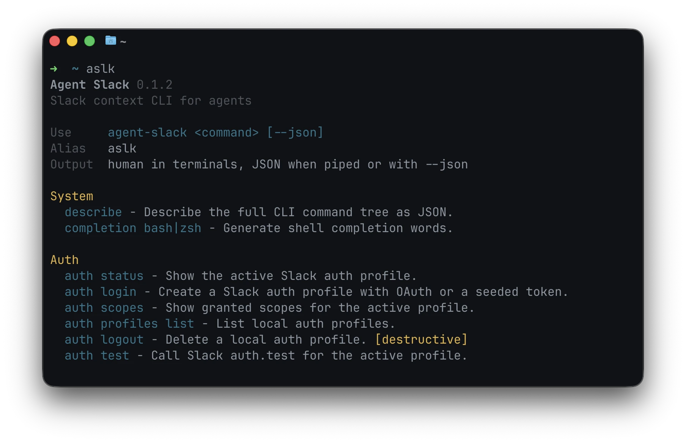

<div align="center">

# Agent Slack

Slack context for AI agents, exposed through the `agent-slack` CLI.
Short alias: `aslk`.

```bash
npm install -g @eliya-oss/agent-slack
```



</div>

## Usage

```bash
agent-slack auth login --oauth --client-id "$SLACK_CLIENT_ID" --client-secret "$SLACK_CLIENT_SECRET" --json
agent-slack conversation history C123 --limit 50 --json
agent-slack thread get --channel C123 --ts 1710000000.000100 --include users,permalinks --json
agent-slack conversation context C123 --include users,threads,permalinks --format ndjson
agent-slack api call conversations.info --payload '{"channel":"C123"}' --json
```

OAuth login opens Slack in your browser. Use `--no-open` to print the URL.

## Skill

```bash
npx skills add Newbie012/agent-slack --skill agent-slack
```

## Notes

Agent Slack respects Slack permissions: it only returns data allowed by the active token, scopes, channel membership, workspace policy, and Slack plan.

Project docs live in `.agents/`.

## License

MIT
