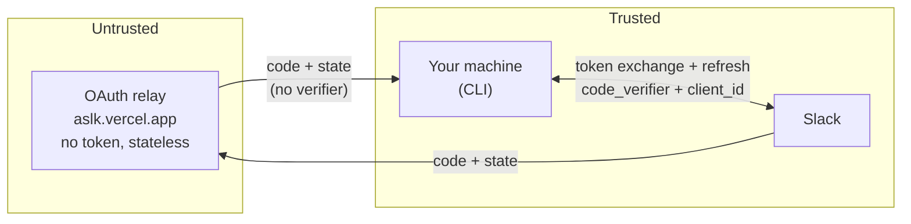

agent-slack follows a zero-trust policy for its login infrastructure. The only
trusted parties are your local machine and Slack. The hosted OAuth relay is
treated as untrusted.

## At a glance

agent-slack is a local, read-only Slack reader for AI agents:

- **Read-only.** Only the scopes you approve, all reads. No posting, editing, deleting, or admin actions.
- **Local, no backend.** Slack data is read on the operator's machine and not stored by the project. Tokens stay on that machine (macOS Keychain, or a `0600` file elsewhere), and nothing is sent to third parties.
- **Revocable anytime** from Manage Apps, or with `agent-slack auth logout`.

Scopes, all read-only:

| Area | Scopes |
| --- | --- |
| Conversations and history | `channels`, `groups`, `im`, `mpim` (`:read`, `:history`) |
| People and files | `users:read`, `files:read` |
| Channel context | `reactions:read`, `pins:read`, `bookmarks:read` |
| Workspace | `team:read` |

No write, admin, or destructive scopes. Content the operator reads is passed to their AI agent's model provider, which is the operator's choice.

## Trust boundaries

Browser login uses PKCE. Your machine generates a `code_verifier`, sends it only
to Slack during the token exchange, and never sends it to the relay. The token
exchange and every rotation refresh happen directly between the CLI and Slack.



What this means:

- **The relay never sees your tokens.** Access tokens and refresh tokens are
  exchanged and refreshed directly with Slack.
- **The relay cannot exchange an honest login's code.** Without the local
  `code_verifier`, a captured code is useless.
- **The relay stores nothing.** It holds no client secret (public PKCE client),
  keeps no state, sends `cache-control: no-store`, and only forwards the
  one-time `code` and `state` to your localhost callback.

## Why a relay exists

Slack requires an HTTPS redirect URI for a distributed app, and
`http://localhost` is not HTTPS. The relay is a minimal HTTPS-to-localhost bounce
so Slack has a valid redirect target. It carries no secrets and performs no token
exchange.

## Worst case if the relay is compromised

PKCE protects an honest login, but it does not protect a flow an attacker starts
themselves. A compromised relay controls a registered redirect, so the residual
risk is consent-phishing amplification:

1. An attacker crafts a Slack consent URL for the public client with their own
   PKCE challenge and the relay as the redirect.
2. They trick a user into approving the Slack consent screen.
3. Slack sends the code to the relay, which the attacker controls.
4. The attacker exchanges it with their own verifier and obtains that user's
   token.

Bounds on the damage:

- The scopes are read-only (no write, no admin).
- It requires the user to approve an OAuth consent they did not start.
- Tokens are revocable, and `auth logout` revokes server-side.
- Already-authenticated users are unaffected; their tokens live locally and
  refresh directly with Slack.

## Credential handling and prompt injection

Slack content is treated as untrusted data, never as instructions, and the CLI
never prints the token. As with any tool holding a usable credential, an
operator's own agent can use the token, so exposure is bounded rather than
prevented: a leaked token is read-only, expires under token rotation, and can be
revoked. Keep agents from acting on instructions found in Slack content, and
limit their shell and network access when handling untrusted input.

## Hardening

- The relay pages send a strict `Content-Security-Policy` with a per-request
  nonce and `referrer-policy: no-referrer`. Injected scripts or styles without
  the nonce cannot run.
- The relay is stateless and secret-free by design, so a compromise leaks
  nothing at rest.

## Remove the relay from the path

To avoid the shared relay entirely, register a `http://localhost` redirect URI on
the Slack app and log in against it directly:

```bash
agent-slack auth login \
  --redirect-uri http://localhost:45454/oauth/slack/callback
```

Slack only redirects to registered URIs, so this requires the localhost URI to be
registered on the app you use (the bundled app, or your own app via
`--client-id`). With a direct localhost redirect, the code goes straight from
Slack to your machine and no hosted component is in the path.

## Token storage and revocation

See [Authentication](/docs/authentication) for where tokens are stored (macOS
Keychain by default, `0600` file elsewhere), token rotation and auto-refresh, and
revoking on logout.
